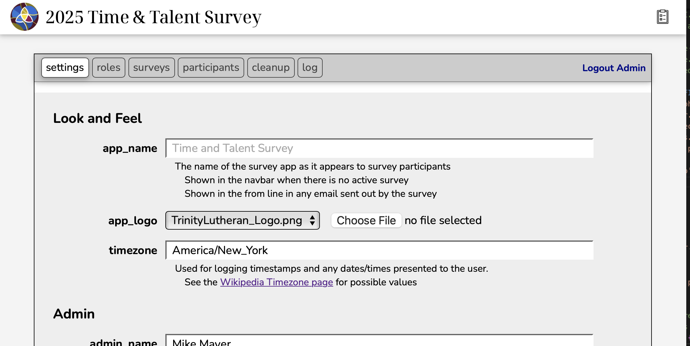
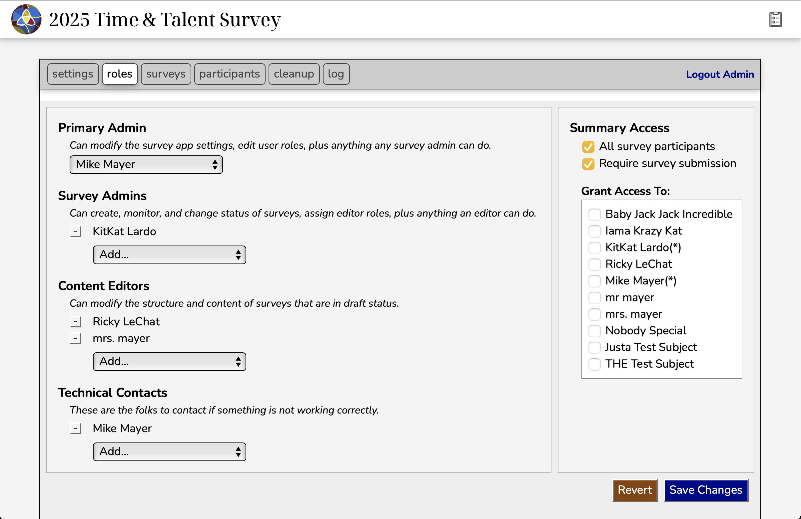
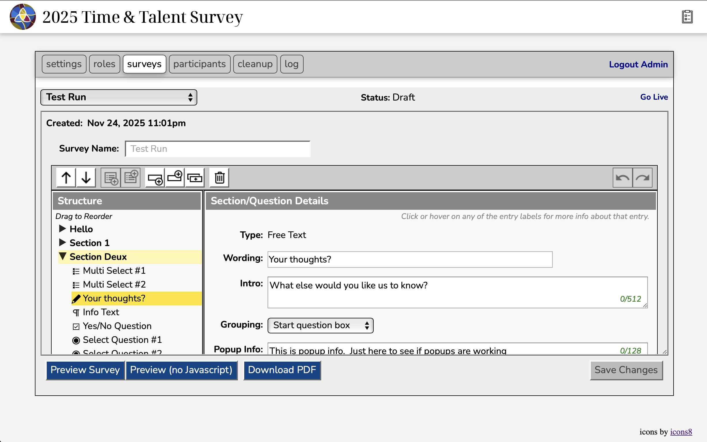
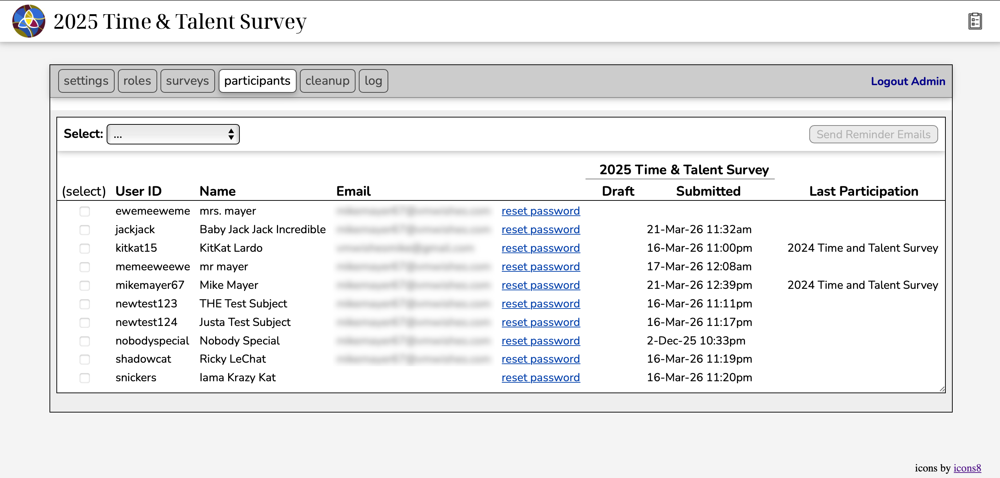
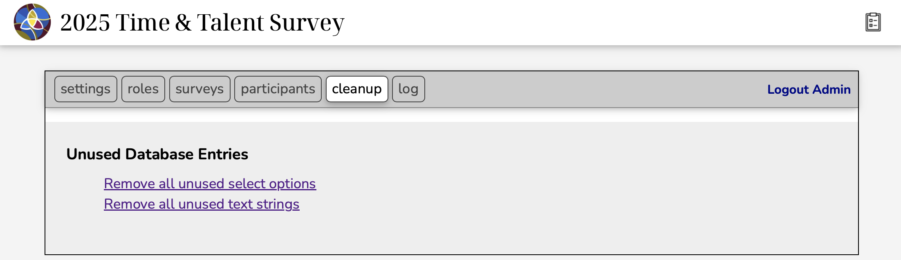
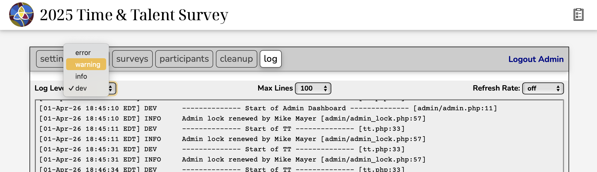

# Admin Dashboard

The admin dashboard provides the tools necessary for the admins to:

- [Customize Survey App Settings](admin_settings.md) (*primary admin only*)

  

- [Assign User Roles and Summary Access](admin_roles.md) (*all admins*)

  

- [Manage Survey Content](survey_content.md) (*all admins and content editors*)

  

- [Manage Participants](managing_participants.md) (*all admins*)

  

- Cleanup Database Tables (*primary admin only*)

  

- View the Survey App Log (*all admins + technical contacts*)

  
