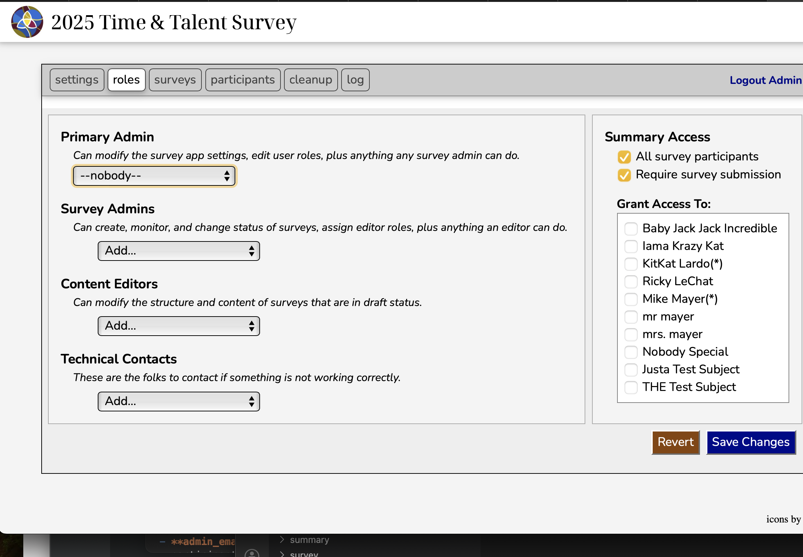
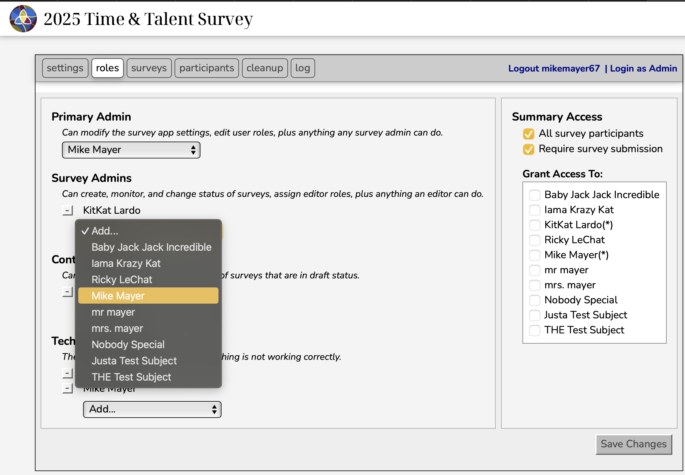

# Assigning Roles

*Before reading through this section, you may want to familiarize yourself with [Admin Roles](admin_roles.md)*

The roles tab on Admin Dashboard provides the means for assigning admin roles and summary visibility rules
to survey participants.

Before any roles have been assigned, the roles tab will look something like the following.  
- The left side of the pane shows the four assignable admin roles.
- the right side ofthe pane shows the summary visibility rules followed by the list of all current survey participants.

## Primary Admin

This provides a dropdown menu from which a single participant can be selected as the primary admin.
It also provides the "--nobody--" if you wish to explicitly assign nobody to the role.

## Survey Admins

This provides a dropdown menu which lists all of the participants not currently assigned the survey admin role.
Selecting a name on this menu adds it to the list of survey admins, which will appear below the Survey Admins
label and the dropdown menu.  Each participant on this list is proceded by a `remove` button (small square with
a minus sign on it).  Clicking this button removes the associated participant from the list.

## Content Editors

This behaves exactly like Survey Admins.

## Technical Contacts

This behaves exactly like Survey Admins and Content Editors

## Example

The following figure shows an example of assigned admin roles

## Summary Visiblity

The figure above also shows the the summary visibility rules (*on the right hand side of the tab*).

There are two general summary visibility rules:

- **All Survey Participants**

  If selected, all survey pariticipants have permission to review the survey results for both the 
  current and past (*closed*) surveys.

- **Require Survey Submission**

  If selected, the summary is not **not** available for viewing for any given paritipant until
  after they have submitted their responses for the survey.

These rules are followed by a list of all survey participants preceded with a checkbox.  If
"All Survey Participants" is not selected, this list is used to provide summary accesses to
individual participants.