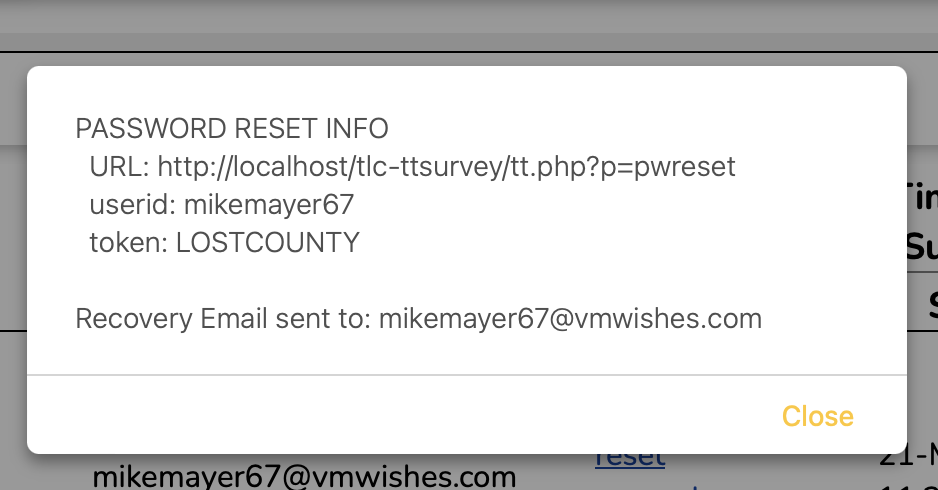
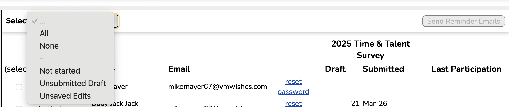

# Managing Participants

*Before reading through this section, you may want to familiarize yourself with [Participating in a Survey](participants.md)*

The participants tab on Admin Dashboard provides the means for very limited management of survey participants.

- **viewing the list of all pariticipants and their current participant status**
  - userid and display name
  - email address (*if provided*)
  - date of most recent draft for current survey
  - date of most recent submisson for current survey
  - most recently closed survey they participated in

- **password resets**
  - generates a unqiue, but easily remembered, password reset token 
  - participant can use this token to change their password 
  - token and instructions will be sent by email (*if included in profile*)
  - *otherwise*, admin must convey the token/URL by some other means
  - URL will be of the form 'https://[survey_domain]/tt.php?p=pwreset'

  

  - **reminder emails**
    - an email reminder can be sent to participants that have not yet submitted responses
    - different wording based on current status
      - no draft or submitted responses
      - submitted responses, but also an unsubmitted draft
      - draft only
    - sendinging reminders is a manual process done by an admin
      - either select the participants using the checkbox in front of their userid
      - or use the "Select" menu to check the boxes automatically based on status
      - click on the "Send Reminder Emails" button

  
  