# Managing Survey Content

*Before reading through this section, you may want to familiarize yourself with [Survey Content](survey_content.md)*

## Creating a New Survey

In the upper left corner of the surveys tab in the [Admin Dashboard](admin_dashboard.md), there is a dropdown
menu to select the survey you wish to view or edit.  Included in this list is an "Open New Survey..." option.
(*If there are currently no surveys defined, this will be the only option.*)  When this option is selected,
you are presented with a form with only two fields:

- Survey Name: the unique name that will be given to the new survey.

- Clone From: dropdown menu used to prepopulate the content of the new survey.

  This will link the questions between surveys.  When a participant first opens a survey that
  was cloned from a prior survey, their form will be prepopulated with their prior responses.

  Cloned question wording can be tweaked, but should not be used to create a brand new question
  as this will cause strange prepopulated responses.

A newly created survey will start out in draft status.

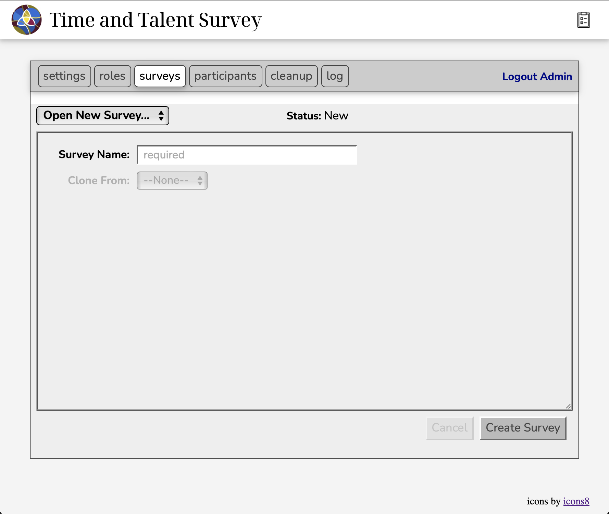

## Selecting an Existing Survey

If there are any existing surveys, the dropdown menu will contain the list of all existing surveys including
the active survey (*no more than one*), any closed surveys, and any draft surveys.  Selecting the active
or a closed survey will display it in view mode.  Selecting a draft survey will open it in edit mode.

## Changing Survey State

Along the top of the survey view, after the survey select dropdown, is the survey status and links that
can be used for changing the status.

Surveys in draft state show the date they were created and provides a "Go Live" link to make the
survey the active survey (*but only if there is not a current active survey*).

Surveys in the active state show the dates they were created and opened (*made active*) and provide
a "Edit" and a "Close" link to either take the survey back into draft state to make additional edits
or into closed state to archive it for future reference.  *Note that taking the survey back into draft
mode could corrupt existing user responses and should be used with caution.*

Surveys in the closed state show the dates they were created, opened, and closed and provide a 
"Reopen" link to take the survey back into active state (*but only if there is not a current active survey*).

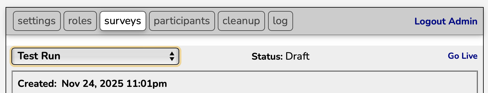

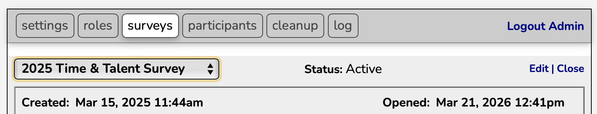

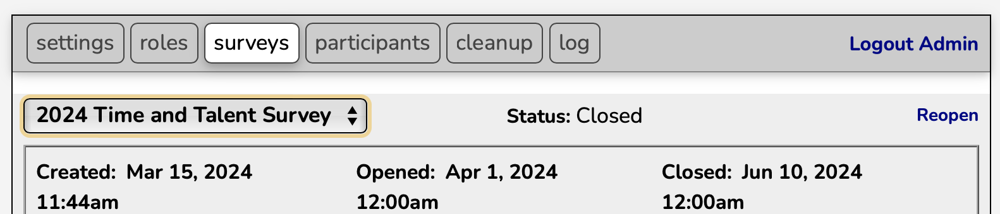

## Editing a Draft Survey

When a draft survey is selected, the survey editor is shown.  The figure below shows what this looks like
for a newly created survey.

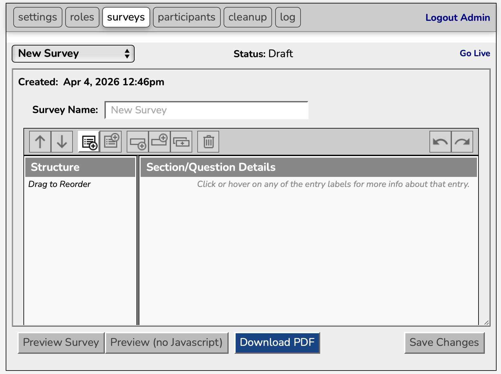

It is composed of 4 main elements:

### Survey Name

This appears just below the status information at the top of the tab.  It is used for 
changing the survey name.  It may be left blank if the name is ok as is.

### Survey Editor Toolbar

This appears just below the Survey Name field.  It consists of a series of buttons that are used
to modify the survey content.  Which buttons are active at any time depends on what is currently
selected in the content navigator (*see below*) and the state of the Undo/Redo queue.

From left to right, the toolbar buttons are:

- **move up**
- **move down**

  These buttons pretty much do what you would expect.  They are used for moving the currently
  selected content item up or down in the content order.  
  
  Moving a section will move it and its content as a block to before/after the prior/next section.  
  
  Moving a quesiton item will move it to before/after the prior/next question.  If the question 
  is the first/last question in a section, moving it up/down will move it to the end/start of t
  he prior/next section's content.

  These buttons are only active if the move makes sense, e.g. you cannot move the first section up.

- **add section below**
- **add section above**

  Thsese buttons also do pretty much what you would expect.  The create a new section either
  after or before the curent section.  This new section will be selected in the navigator
  and displayed in the editor, ready for populating its details.

  These buttons are always active, with the minor exception that the `add above` is only
  active if there is at least one section.

- **add question below**
- **add question above**
- **clone question**

  Like the `add section` buttons, these three buttons are used to create a new question or
  info text item.  This new content item will be selected in the navigator and displayed in
  the editor, ready for selecting the item type and populating its details. 

  The `clone` button adds the new item as if `add question below` were used to create a new
  item, but the type and most of the fields are prepopulated in the editor based on the 
  item it was cloned from.

  These buttons are only active when it makes sense, e.g. whether a section or content item is
  selected in the navigation pane.

- **delete**

  Deletes the currently selected section or question.  This is immediate.  But never fear...

- **undo**
- **redo**

  These buttons control the undo stack.  The undo button undoes your last action (*including delete*)
  and adds it to the redo stack.  The redo button undoes an undo action and returns the action to
  the undo stack.

  Pretty much anything you can do in the navigation or editor panes is an undoable action. I am not
  going to attempt to list them all here.

  *Note that while the undo stack (and thus the redo stack) are limited to 1000 actions, only the
  most recent 1000 actions will be undoable.  But, do you really want to have to hit that button
  1000 times?  In this case, you are probably better off reverting all edits and starting over.*

### Survey Content Navigator

The content provides a quick view of the structure and layout of the currently defined sections and 
content items.  Selecting an item on this list determines what appears in the content editor and
activates buttons in the toolbar.

In addition to using the `move up` and `move down` buttons in the toolbar, items can be rearranged
simply by dragging them in the navigation pane.

Sections are shown with 'turn down' arrows to collapse or open sections for easier navigation.

Questions are shown with an icon indicating type.

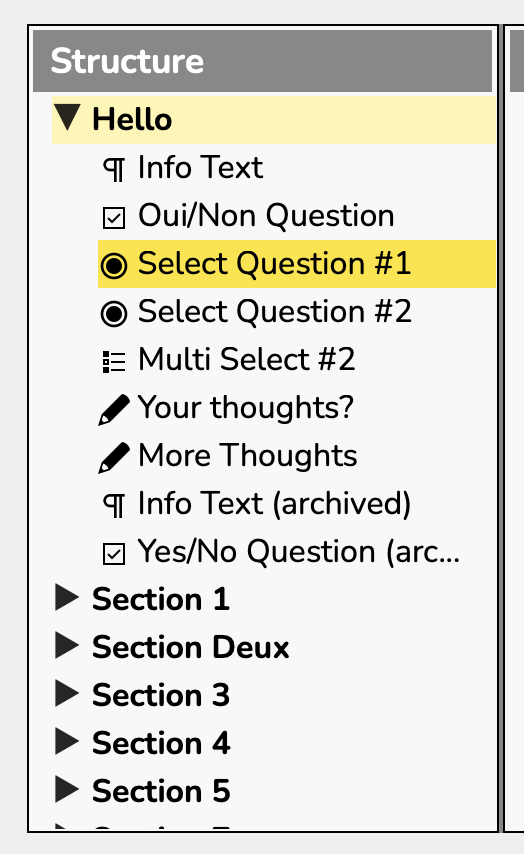

### Section Editor

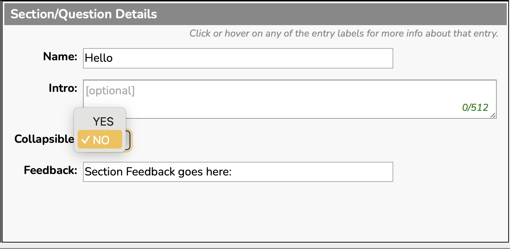

The section editor provides 4 fields for configuring how the section is displayed

- **Name**
  
  This is what will be displayed in the navigator pane and in the survey itself.
  Note that non-collapsible sections do not include the name in the survey, just its
  content.

- **Intro**

  This field provides optional text in the survey that can be used to describe the section
  or provide any other additinoal info that pertains to the content of the section.
  The content of the intro text may include 
  [markdown](https://markdownguide.offshoot.io/basic-syntax/) to format the text.

- **Collapsible**

  Indicates if the section should be collapsible by participants as they fill out
  their survey responses.  Collapsibile sections make navigating the survey easier
  by compacting the content.  Non-collapsible sections should be reserved for use
  to display important information or questions that you don't want the participant
  to miss because they chose not to view this section.

### Info Block Editor

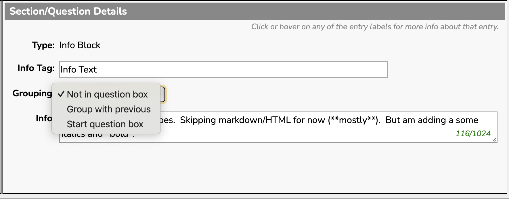

The editor provides 2 fields for configuring how the info block is displayed

- **Info Tag**

  This optional label is used only in the navigation pane as the full info text will
  probably be too long to be fully displayed.  If the info tag is not provided, the
  start of the info text will be displayed, truncated to fit the width of the 
  navigation pane.

- **Grouping**

  This determines how the info block will be included when questions are grouped
  together in the survey and response summaries.  The three possible options are

  - *Not in question box:* the info text is never shown in a group
  - *Group with previous:* the info text is included in the 'current' group
  - *Start question box:* the info box begins a new group

- **Info**

  This is the text that will displayed in the survey. It may contain
  [markdown](https://markdownguide.offshoot.io/basic-syntax/) to format the text.

  This text will only be shown in response summaries if it appears within a 
  question group.

### Simple Checkbox Editor

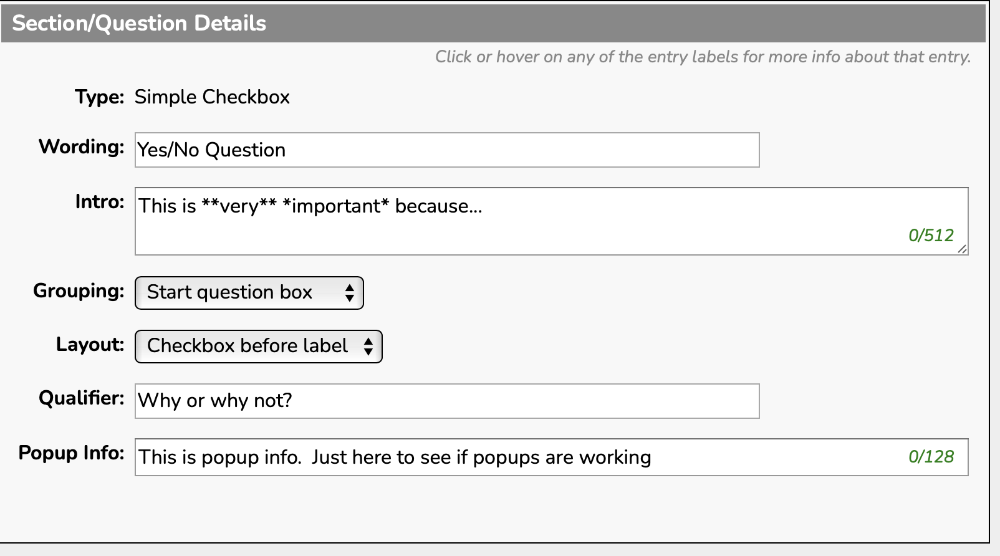

The editor provides 6 fields for configuring how the simple checkbox is displayed

- **Wording**

  This is the label that will be displayed before or after the checkbox

- **Intro**

  This provides optional information in the survey about the question.  It may contain 
  [markdown](https://markdownguide.offshoot.io/basic-syntax/) to format the text.

- **Grouping**

  All actual questionsi (*i.e., not info blocks*) always appear in question groups 
  in the survey. This determines if this question starts a new question group or
  continues in the currently open group.

  - *Group with previous:* the info text is included in the 'current' group
  - *Start question box:* the info box begins a new group

- **Layout**

  This determines if the label appears before or after the checkbox.

  - *Checkbox before label:* the checkboxes will be left aligned within the question group
  - *Checkbox after label:* the checkboxes will be right aligned within the question group

- **Qualifier**

  This provides an optional prompt to allow the participant to provide some additional 
  feedback about this question other than "yes" or "no".  If no prompt is provided, the
  survey will not include a field for providing this additional information.

- **Popup Info**

  This provides text for an optional popup help box that will appear when a particpant
  hovers over (or clicks on) the question text in the survey.

### Single Selection and Multiple Selection Editors

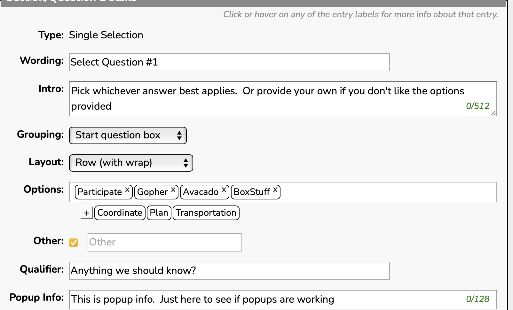

The editor provides 8 fields for configuring how both single and multiple selection questions
are displayed

- **Wording**

  This is the label that will be displayed before or after the checkbox

- **Intro**

  This provides optional information in the survey about the question.  It may contain 
  [markdown](https://markdownguide.offshoot.io/basic-syntax/) to format the text.

- **Grouping**

  All actual questionsi (*i.e., not info blocks*) always appear in question groups 
  in the survey. This determines if this question starts a new question group or
  continues in the currently open group.

  - *Group with previous:* the info text is included in the 'current' group
  - *Start question box:* the info box begins a new group

- **Layout**

  This determines how the options are layed out after the label

  - *Row (with wrap):* options are layed out in one or more rows as dictated by the browser width
  - *Left-aligned column:* options are layed out in a single left-aligned column
  - *Right-aligned column:* options are layed out in a single right-aligned column

- **Options**

  This is where the list of options is set.  Options are added by either dragging one of the 
  currently defined options from below the options box into it or by clicking on the [+] button
  to add a new option.  Options can be removed from the list by dragging them out of the box.
  Option order can be changed by dragging options around within the box.

- **Other**

  If selected, an additional option is added to the survey that contains an write-in box for
  the participant to provide their own response.  If selected, the editor displays an
  extra field that allows the default prompt ("Other") to be replaced with a custom prompt.

- **Qualifier**

  This provides an optional prompt to allow the participant to provide some additional 
  feedback about this question other than "yes" or "no".  If no prompt is provided, the
  survey will not include a field for providing this additional information.

- **Popup Info**

  This provides text for an optional popup help box that will appear when a particpant
  hovers over (or clicks on) the question text in the survey.

### Free Text Editor

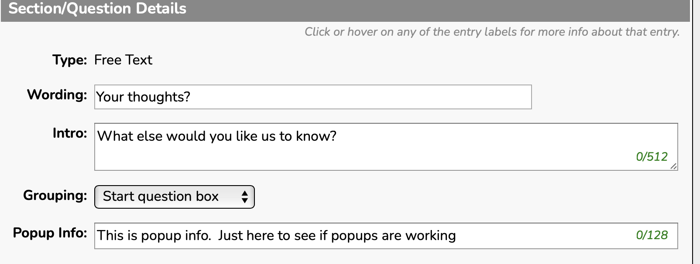

The editor provides 4 fields for configuring how the free text question is displayed

- **Wording**

  This is the label that will be displayed before or after the checkbox

- **Intro**

  This provides optional information in the survey about the question.  It may contain 
  [markdown](https://markdownguide.offshoot.io/basic-syntax/) to format the text.

- **Grouping**

  All actual questionsi (*i.e., not info blocks*) always appear in question groups 
  in the survey. This determines if this question starts a new question group or
  continues in the currently open group.

  - *Group with previous:* the info text is included in the 'current' group
  - *Start question box:* the info box begins a new group

- **Popup Info**

  This provides text for an optional popup help box that will appear when a particpant
  hovers over (or clicks on) the question text in the survey.

## Survey Editor Actions

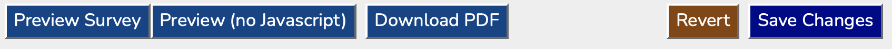

At the bottom of the survey pane, there are 5 buttons shown when working 
with a draft survey.

- **Save Changes**

  This is where you commit the edits you've made.  You must click on this button to
  save your edits.

- **Revert**

  Takes the survey content back to the last saved state.  All your current edits will
  be lost.  Be careful with this button.  This is **NOT** and undoable action.

- **Preview Survey**

  Opens a new browser tab to display the survey as it will appear to participants.
  This does not actually commit your edits to the database.  You must still hit the
  Save Changes button for the edits to be committed.

- **Preview Survey (no Javascript)**

  Same as Preview Survey but shows how the survey will appear and interact with
  the participant if they have Javascript disabled.

- **Download PDF**

  Downloads a printable PDF of the most recently saved survey content.  Note that
  this does not include any edits you have not yet committed to the database.

## Viewing the Active or a Closed Survey

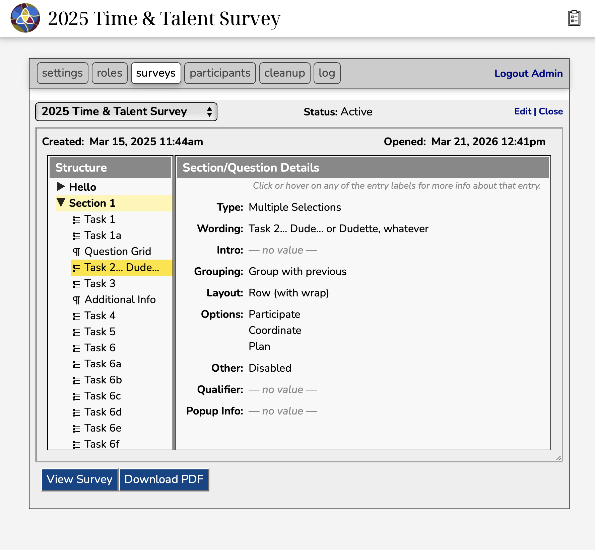

Essentially the same survey pane is shown as for editing a survey except that none of the fields
are actually editable.  The key differences are:

- The toolbar is not shown.
- The Save and Revert buttons are not shown.
- The navigation pane does not allow dragging items around.

