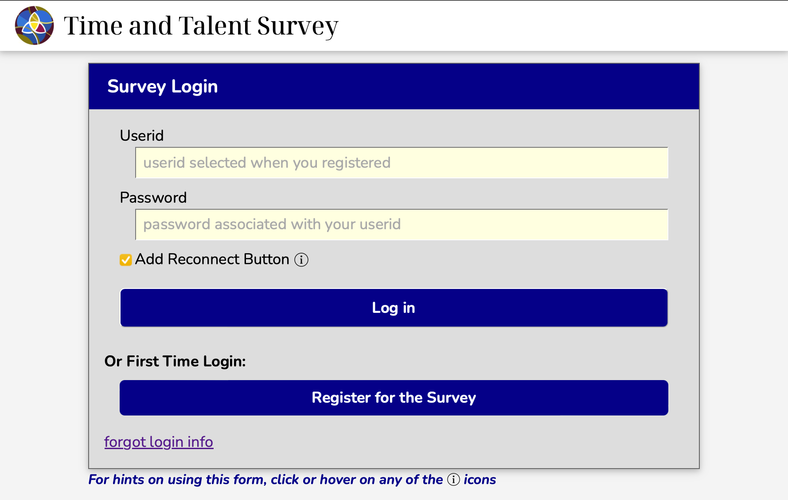
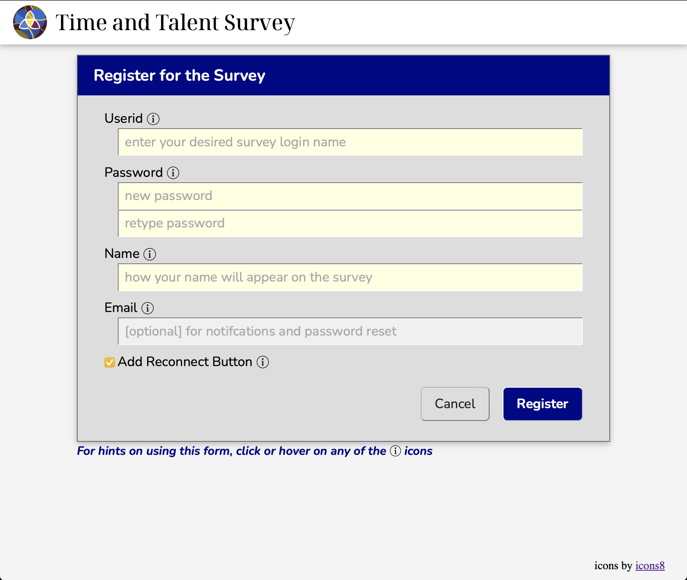
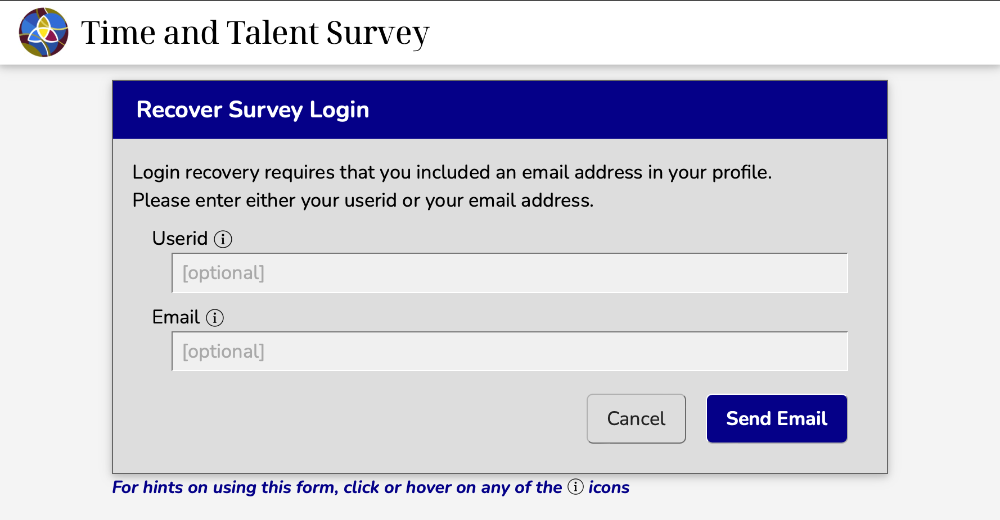
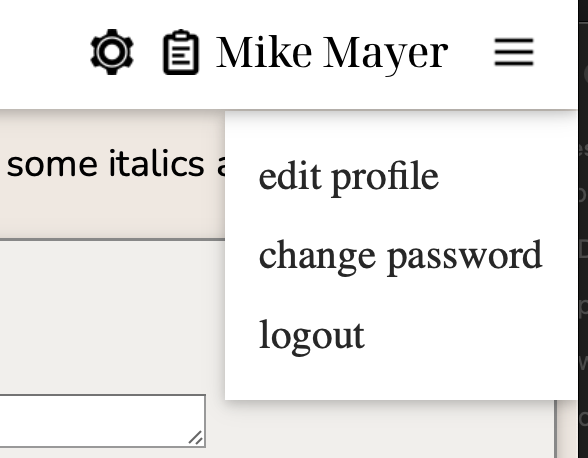
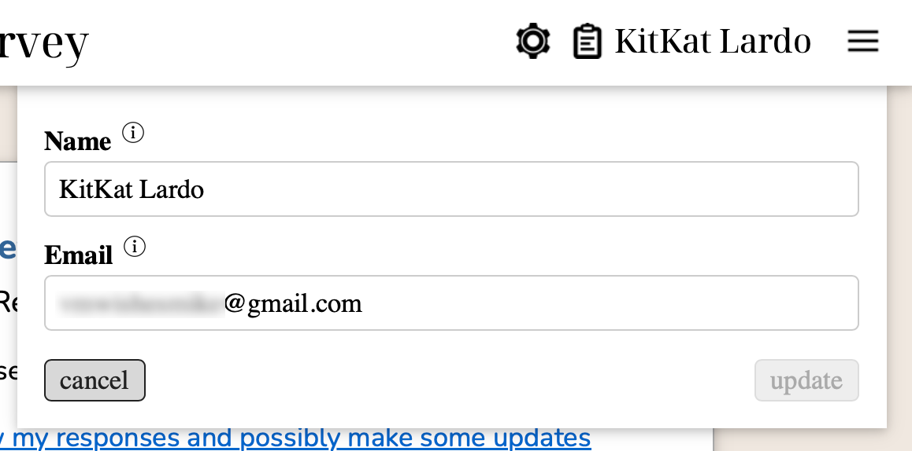
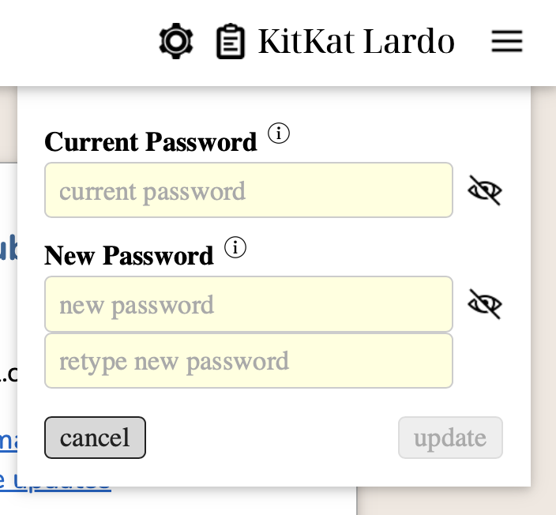

# Survey Participants

## Logging In

Survey participants register for and manage their own account. There is no need for an admin to 
create a user login.

When someone brings up the survey app in their browser and are not currently logged into the 
app, they are presented with the login page:

They have the option to:

- Click on their 'quick login' button (*if they selected "reconnect" on last login*)
- Enter their userid and password
- Register for a new account
- Request a password reset email be sent to them (*email address must be in their profile*)

### Registering for a new account

When a user elects to register for a new account, they will be presented with a registration form:

The will need to provie:
  - a unique userid (*no two users can have the same userid*)
  - a password (*rules are provided as an info button in the form*)
  - display name that will be used in the survey and response summary
  - (optional) email address for password recovery and notifications

Once they submit the form, they will be able to log into the survey with the newly created userid and password.

### Requesting a password reset

If a user forgot their userid or password and if they provided an email address in their profile, they
can request to have their login info sent to them.  The password reset form looks like:

Either the userid or email address needs to be entered into the form.  If an email address is provided
and is used by more than one account, the email will contain the userids for each of the accounts
associated with that address.

The email will contain a single use reset token and instructions on how to complete the password
reset.

Once their password is reset, they will be able to log into the survey with their existing userid and new password.

## Managing Your Account

Each participant can manage their profile settings and their submitted responses to the active survey.

### User profile

Once logged in a participant can update their profile information or their password via the
"hamburger" menu at the right end of the navigation bar. 

The dialog boxes for updating the profile and password should be completely straightforward
as shown below.

### Submitted responses

A participant may visit the survey many times to work on their responses before submitting.
Their work will be stored in a draft state. Responses in the draft state are not included in
the response summary.

Once a participant has submitted their responses, their response status changes from draft
to submitted.  After that, the active survey page is replaced with user status page:

The user may choose to either:

- review their responses with option to make updates
- withdraw their responses to draft status while making updates

In the first case the survey remains in the submitted state but the participant goes 
back to the active survey page where they can review their responses, make changes if
they wish, and then either save the changes as a new draft (the current submitted
responses are not updated) or submit the updates (replacing the old responses).

In the latter case, the survey is taken out of the submitted state and returned to
draft status (using the current submitted responses to seed the draft).  From there,
they have the same options as above: update the draft or resubmit their new
responses.