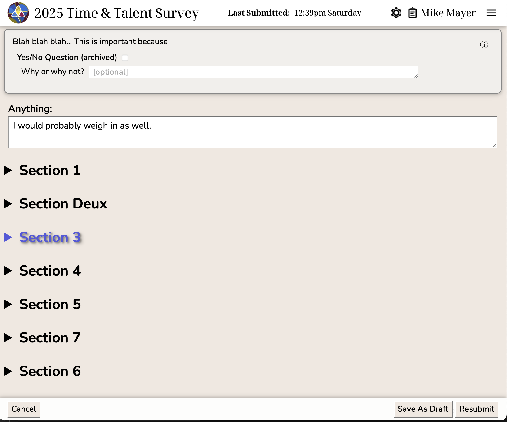
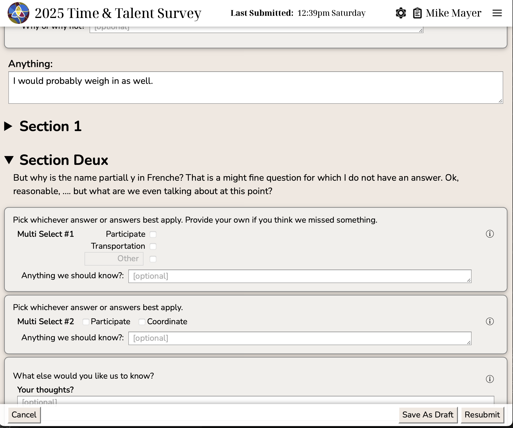

# Survey Content

## Survey Sections

Each survey contains one or more sections.  Sections contain one or more questions plus informational text.
The intended purpose for sections is to provide a logical grouping of related survey questions.

- Sections may contain a block of introductory text which will be displayed in the survey before any of the
other content.  This intro text may contain [markdown](https://markdownguide.offshoot.io/basic-syntax/) 
to help format how it will appear in the survey.

- Sections may be marked as collapsible.  
  - This allows for a more compact display of the survey.  
  - Non-collapsible sections are always visible.  
  - Only one collapsible section will be visible in the survey at any time.
  - The section name is only visible for collapsible sections

  See the figures at the bottom of this page to see examples of closed and open sections.

- Sections may include a feedback block which will add a freetext response field at the end of that section.

## Info Text

Informational text can be dispersed at any point within a section. Like section introductions, this may
contain [markdown](https://markdownguide.offshoot.io/basic-syntax/) to control how its text will appear 
in the survey.

## Questions

There are four types of questions which can be included in the survey:

- **Simple Checkbox**: 
  - "yes/no" responses
  - participant either selects it or doesn't
  - a freetext box may be provided which allows the particpant to qualify their response

- **Single Select**: 
  - multiple choices are provided
  - an optional "other" field may be provided with a customizable label
  - participant may select a single response or leave the question blank
  - a freetext box may be provided which allows the particpant to qualify their response

- **Multi Select**:
  - multiple choices are provided
  - an optional "other" field may be provided with a customizable label
  - participant may select as many response as they feel apply
  - a freetext box may be provided which allows the particpant to qualify their response

- **Freetext**:
  - a large resizable input box is provided to allow the user to respond to open ended
    questions in their own words

Questions may be visibly grouped. 
Grouped questions will have their responses aligned to emphasize the questions are related to one another.

## Screenshots

In the screenshots below, the very first section is not collapsible and therefore all of its
content is always visible.  These screenshots show the top of the list of collapsible sections.

The first shows all collapsible sections closed.  The second shown one open section.

